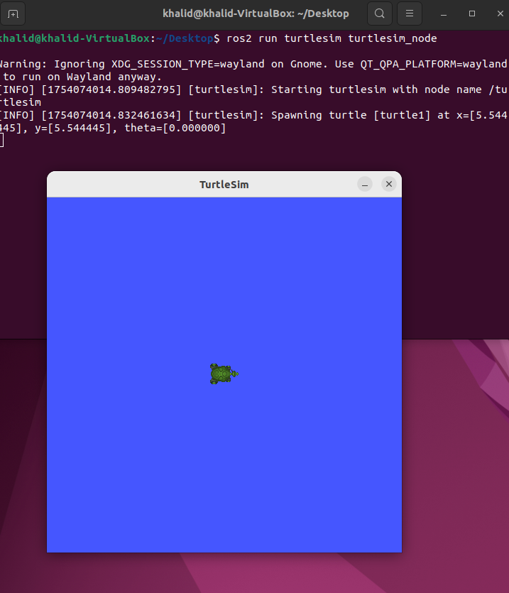
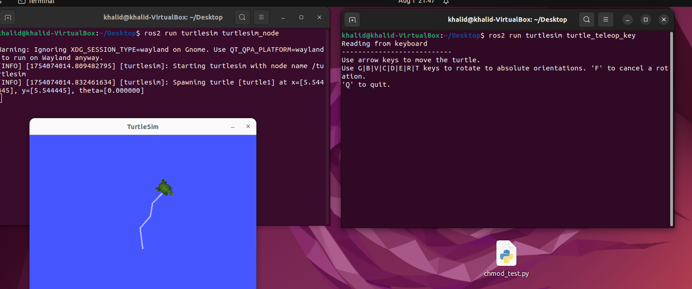
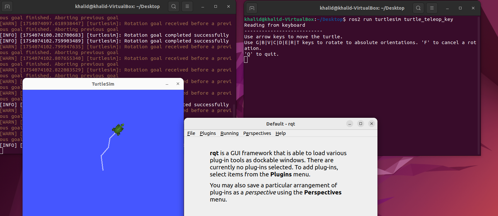
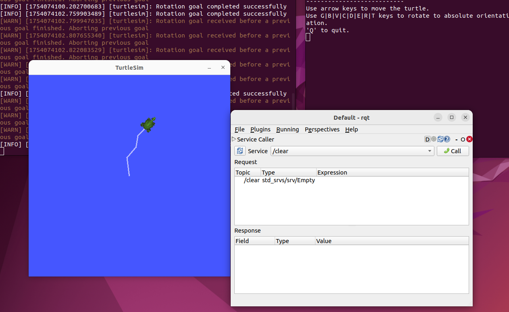
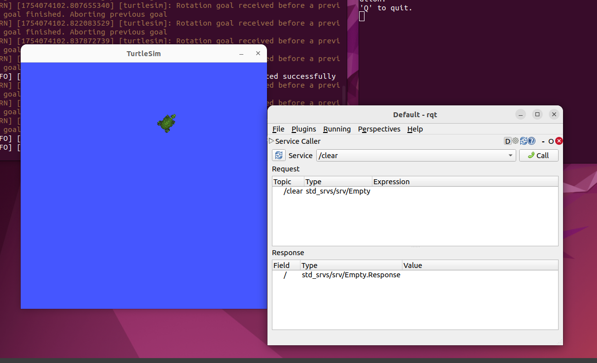
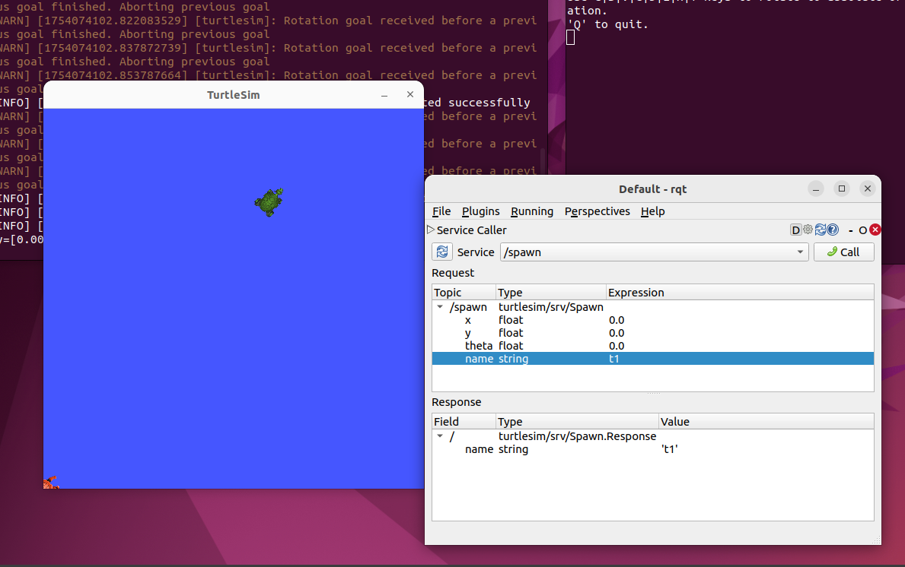
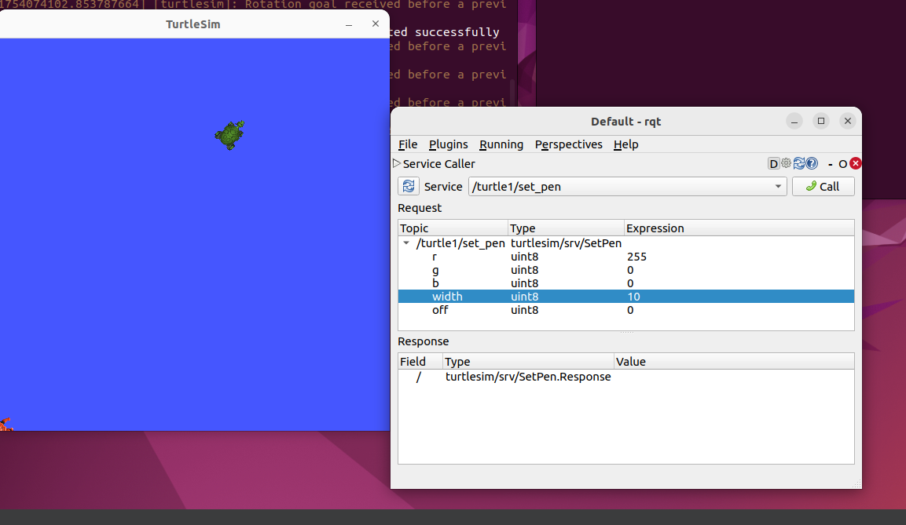
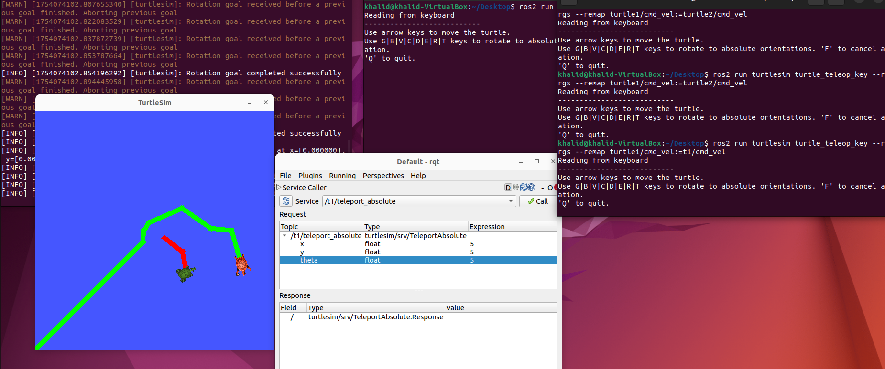

# 🐢 ROS 2 TurtleSim - Turtle Movement and Service Call Example

This project demonstrates how to control turtles using ROS 2 TurtleSim with both **keyboard teleop** and **service calls (via rqt)**.

It shows:
- Turtle movement via keyboard
- Spawning turtles
- Setting pen color and width
- Clearing the screen
- Teleporting turtles
- Using `rqt` to call services

---

## 🧰 Requirements

- ROS 2 (Humble or newer)
- `turtlesim` package
- `rqt` and `rqt_service_caller`

Install them using:
```bash
sudo apt update
sudo apt install ros-${ROS_DISTRO}-turtlesim ros-${ROS_DISTRO}-rqt ros-${ROS_DISTRO}-rqt-service-caller
```

---

## 🚀 Step-by-Step Execution

### 1. Launch the TurtleSim Node

```bash
ros2 run turtlesim turtlesim_node
```

  


---

### 2. Move the Turtle with Keyboard

In a new terminal:

```bash
ros2 run turtlesim turtle_teleop_key
```

Use the arrow keys to move the turtle.

  


---

### 3. Service Callers

Open `rqt`:

```bash
rqt
```

Then choose:
```
Plugins > Services > Service Caller
```

This Service Caller can provide many functions, such as changing the pen, clearing the screen, or spawning a new turtle.





  


---

### 4. Clear the Drawing

Call `/clear` service in `rqt`.

🖼️  


---

### 5. Spawn a New Turtle

Call `/spawn` service and set:
- x: 0.0
- y: 0.0
- theta: 0.0
- name: `t1`

🖼️  


---

### 6. Move the New Turtle (`t1`) with Keyboard

Remap the command topic:

```bash
ros2 run turtlesim turtle_teleop_key --ros-args --remap turtle1/cmd_vel:=t1/cmd_vel
```

  


---

### 7. Teleport the Turtle

Use `/t1/teleport_absolute` to teleport the turtle to (x=5, y=5, theta=5).

 


---

## ✅ Summary

This simple demo shows how to:
- Interact with turtles using ROS 2 services
- Use `rqt` GUI for service calling
- Remap topics and control multiple turtles

---
